# Partes que conforman el UX y el UI de Pinterest

* **Track:** _Common Core_
* **Curso:** _Creando un sitio web interactivo con JavaScript_
* **Unidad:** _Intro a User Experience Design_

## Objetivo
---
El reto consiste en identificar qué partes conforman parte el UX y el UX de la página web Pinterest.
#### UX:
1. Facilitar el acceso a Pinterest por medio de un correo tercero, cuenta de Facebook o correo de Google.
2. Permitir la posibilidad de hacer una búsqueda específica y rápida.
3. Permitir ver búsqueda aparte, mostrar la página web de la que proviene la imagen, preguntar si ha utilizado la información de la imagen y sugerir compartir esa experiencia, mostrar qué otro usuario ha guardado la imagen, mostrar recomendaciones relacionadas a la búsqueda.
4. Facilitar el hecho de guardar rápida y directamente sus búsquedas por tableros por temas, los que a su vez se pueden subdividir. Además de poder agregar y editar un comentario para cada imagen.
5. Indicar si una búsqueda ya ha sido guardada y especificar en qué tablero.
6. Mostrar qué tableros se utiliza más.
7. Permitir contar con un chat para interactuar con amigos.
8. Tener notificaciones cronológicas de recomendaciones.
9. Mostrar mensajes al usuario para indicarle qué hacer.
10. Permitir compartir sus intereses a otras personas por medio de redes sociales, enlace o mensaje directo a un usuario de Pinterest.
11. Permitir ver de manera organizada y gráfica las búsquedas de imágenes por medio de filtros: tableros, pines, probado. Además de informar la cantidad de imágenes que hay en cada filtro.
12. Permitir saber cuántos seguidores tiene y a cuántos sigue.
13.

#### UI:
1. Los colores de la marca: rojo y blanco.
2. Diseño de los íconos.
2. Diseño de los botones.
3. Diseño de los menús.
4. Elección de la fuente y su tamaño.
5. Elección de la paleta de colores de los input, botones, notificaciones, mensajes y el fondo: plomo, rojo, verde oscuro, blanco.
6. Navegación global, local y filtrada (temática), contextual (recomendaciones) y en línea (enlaces a página origen de imágenes).

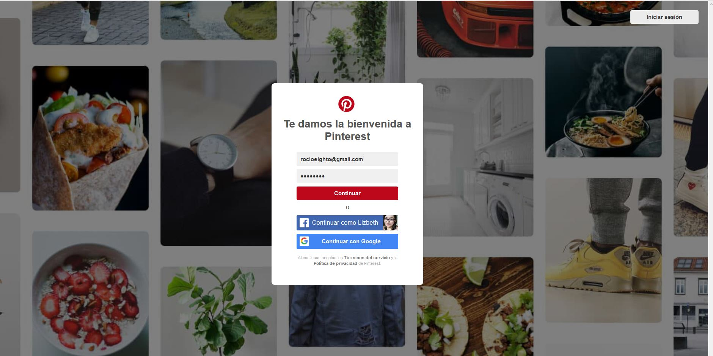

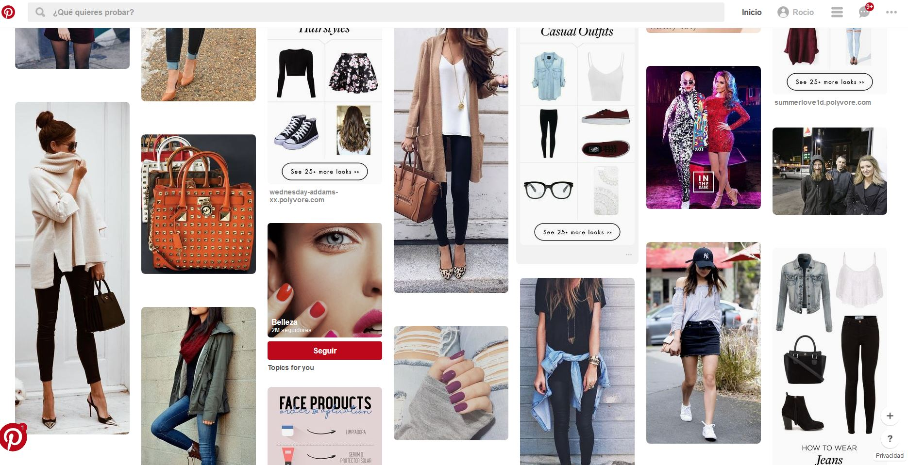

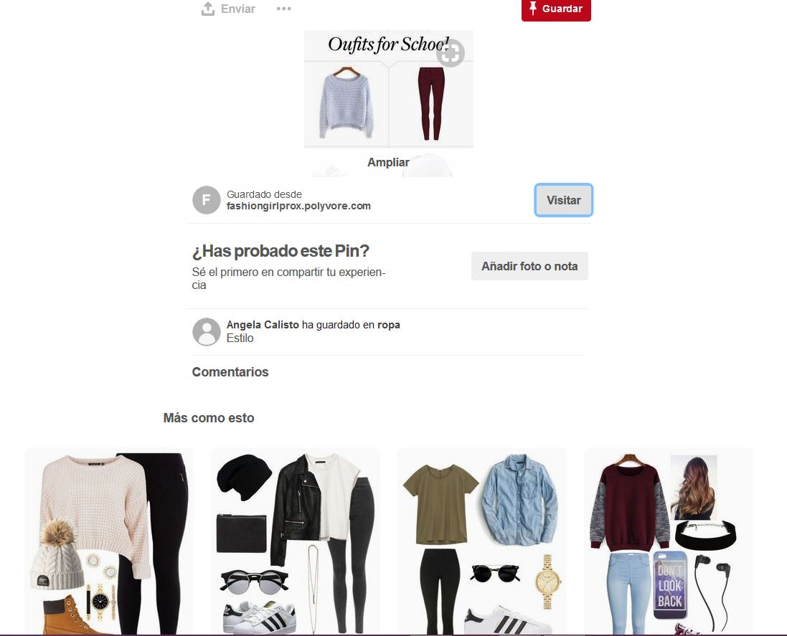

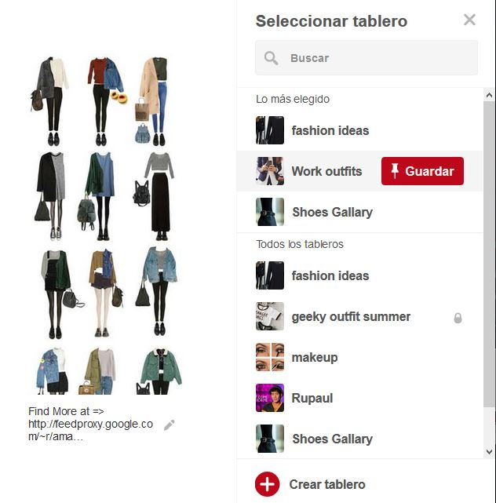

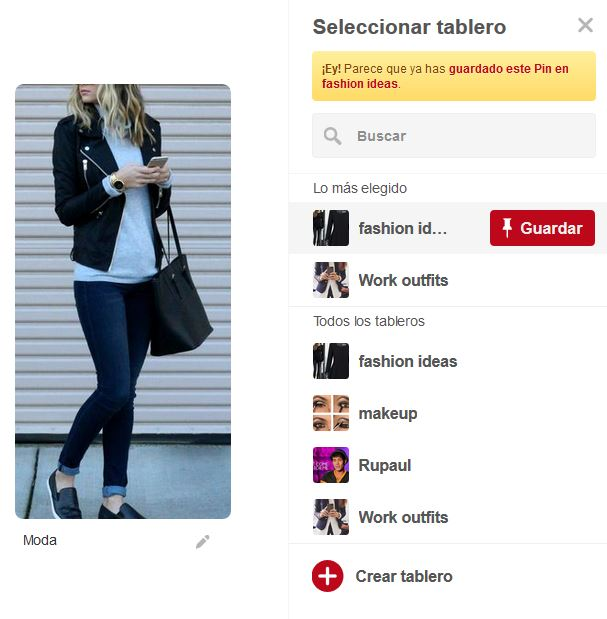

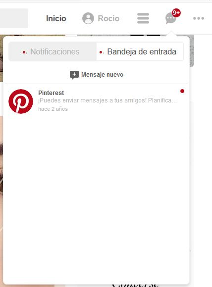

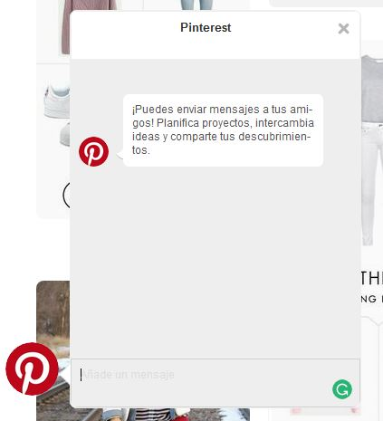

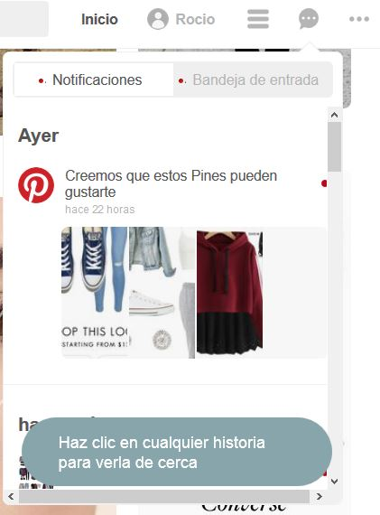

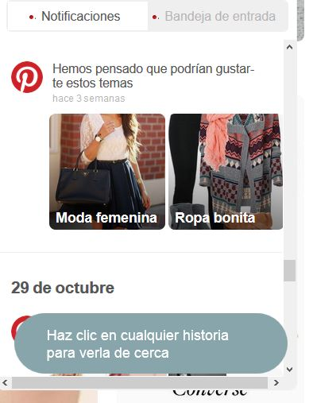

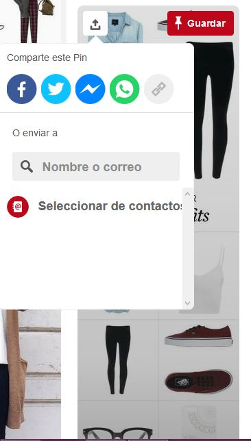

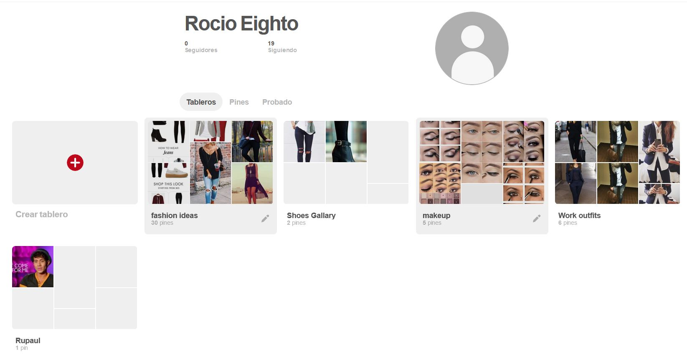

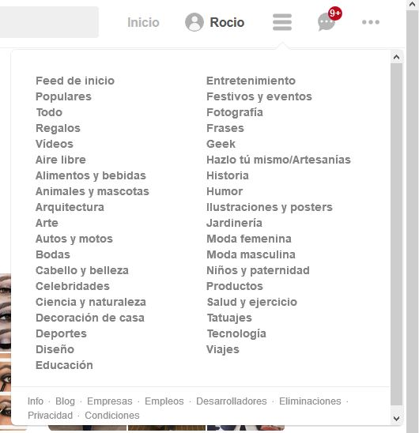

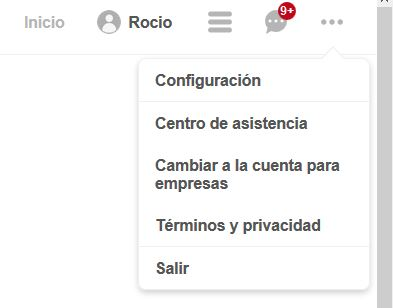

## Contenido

Este proyecto contiene:
1. Un archivo  **`README.md`** que explica el contenido del repositorio.

2. Una carpeta `assets` donde se encuentra la carpeta `images` con la imagen del logo de Trello en formato ***png***, y la carpeta `icons` con la carpeta `icomoon`, que a su vez contiene a la carpeta `fonts` con los íconos y una hoja de estilos llamada `style`.

## Autora
Lizbeth Félix Peña

## Fecha
25/11/2017
